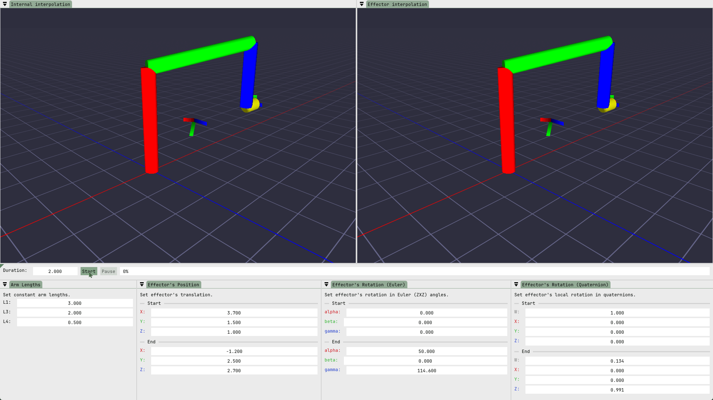
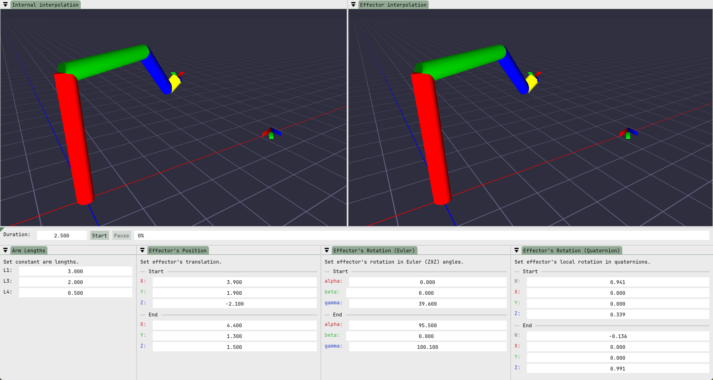

# puma

The aim of the project is to simulate the motion of a PUMA robot in two different ways:
- solve an inverse kinematics (IK) problem for the initial and the final configurations of the effector and interpolate (LERP for position, SLERP for rotations) the resulting parameters in each frame (left-hand side of the visualization)
- interpolate the position and rotation of the effector, and solve an IK problem for the resulting configuration in a given frame (right-hand side of the visualization)

Please note that the simulation is not physics-based, i.e., the arms can intersect one another, as collisions are not taken into account.

## The construction of the robot
The kinematic chain of the PUMA robot consists of one prismatic and five revolute joints. The second (green in the visualization) arm can change its length, while the remaining arms' sizes remain constant. 

## User interface

The user can specify the initial and final configurations of the effector (that is, the position and rotation in Euler angles or quaternions). For the arms whose lengths remain constant during the motion, the user may adjust their size. Upon changes to the initial parameters, the PUMA is reoriented automatically. The simulation starts upon pressing the "Start" button, next to the progress bar. The duration of the simulation may also be changed, but only before running the animation.
